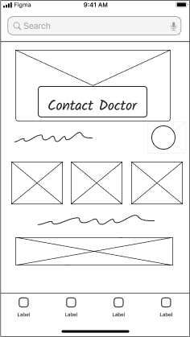
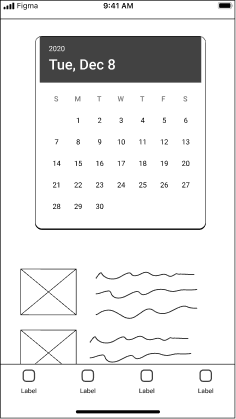
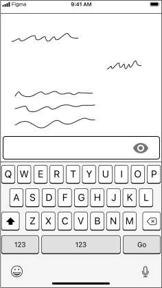
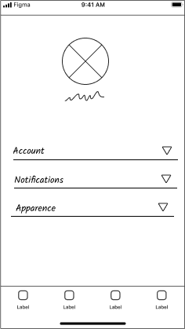
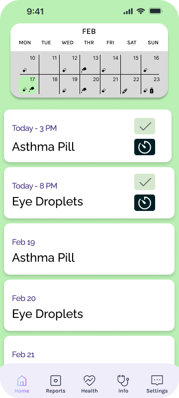
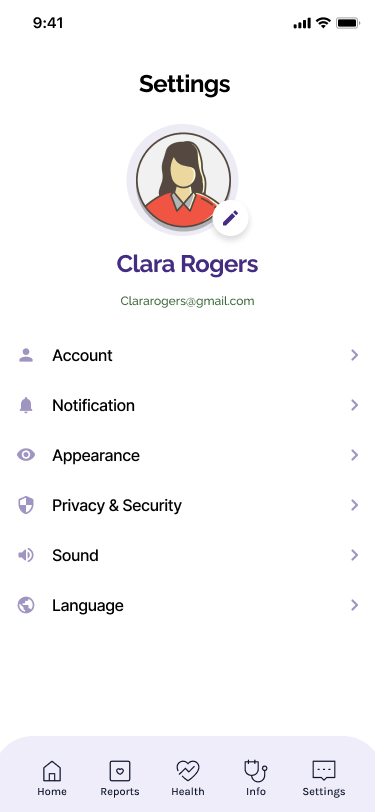
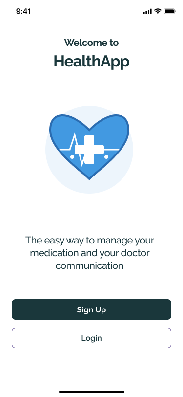

# Health Companion UX Case Study 🚀

Hey there! 👋 Welcome to the UX case study for our awesome Health Companion app!

## What's This All About? 🤔

We're diving deep into the user experience of a mobile app designed to help individuals manage chronic health conditions. Think medication reminders, doctor appointment tracking, and easy communication with healthcare pros. It's all about making life a little easier and healthier!

## Check It Out Live! 🌐

Want to see the magic in action? Click the link below to explore the live website:

[Health Companion UX Case Study](https://gitexcited.github.io/soen357-health-companion-ux-casestudy/)

## Contribute to Our Research! ✍️

We'd love to hear your thoughts on the app! If you have a few minutes, please fill out our research form:

[Share Your Feedback!](https://forms.gle/CranPbBjda89NUm59)

## What You'll Find Here 🕵️‍♀️

* **The Problem:** Understanding the challenges faced by individuals managing chronic conditions.
* **Our Solution:** How our app addresses these challenges with a user-friendly design.
* **UX Research:** Key findings and insights that shaped our design decisions.
* **Next Steps:** Where we're headed and how we plan to make the app even better!

## Wireframes 📱

Here's a sneak peek at the wireframes we designed for the app:

<table style="width:100%">
  <tr>
    <td style="width:25%">
      
Main Page

      
    </td>
    <td style="width:25%">
      
Calendar

      
    </td>
    <td style="width:25%">
      
Chat

      
    </td>
    <td style="width:25%">
      
Settings

      
    </td>
  </tr>
</table>

## Prototype Screenshots 📱

Here's a look at the prototype:

<table style="width:100%">
  <tr>
    <td style="width:33%">
      
Main Page

      
    </td>
    <td style="width:33%">
      
Chat With Doctor

      
    </td>
    <td style="width:33%">
      
Medical History

      
    </td>
  </tr>
  <tr>
    <td style="width:33%">
      
Calendar

      
    </td>
    <td style="width:33%">
      
Settings

      
    </td>
        <td style="width:33%">
      
Splash

      
    </td>
  </tr>
</table>

## Let's Connect! 🤝

Feel free to explore, share your thoughts, and get in touch if you have any questions or ideas. Let's build a healthier future together! 💖
